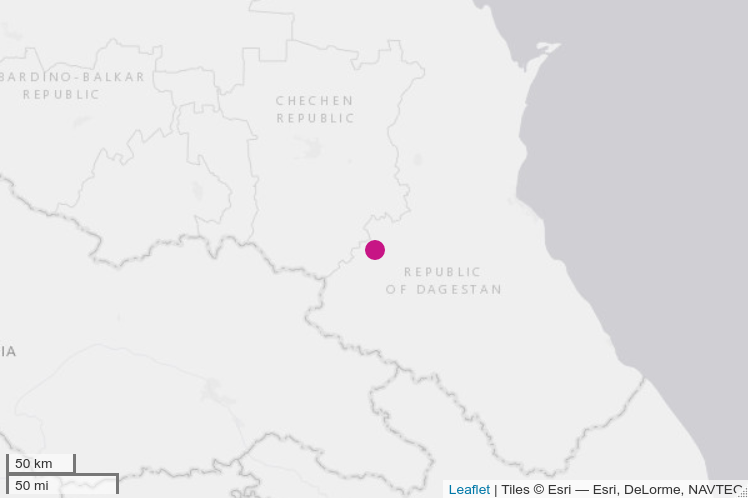
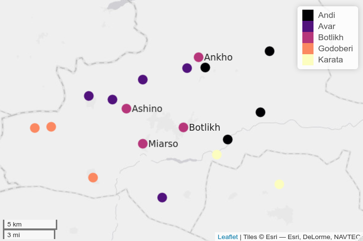

```{r setup, include=FALSE}
knitr::opts_chunk$set(echo = FALSE)
library(tidyverse)
library(lingtypology)
library(wesanderson)
survey <- read_tsv("attitude.csv")
```

# Abstract
This paper explores the vitality of the Botlikh language and the attitudes of its speakers towards their native language. Botlikh is an unwritten language of the East Caucasian family spoken mainly by several thousand people in three villages in Dagestan -- a multi-ethnic autonomous republic in the North Caucasus region of the Russian Federation. Several factors potentially threaten the language, including urbanization and changing marriage practices and demographics, negative self-identification, and pressure from other languages associated with higher socio-econonomic prestige. In this paper I provide a comprehensive account of the context behind these factors and attempt to assess their impact on the language based on a survey among speakers as well as anecdotal evidence gathered during my trips to the area. I also describe how I conducted linguistic fieldwork remotely while I was unable to travel to Dagestan, first during the COVID-19 pandemic, and again after the 2022 Russian invasion of Ukraine.


# 1 Introduction

Botlikh ([botl1242](https://glottolog.org/resource/languoid/id/botl1242)) *bujχaɬi mic'ːi* is an unwritten language spoken in Dagestan (North Caucasus, Russian Federation). It belongs to the Andic branch of the East Caucasian or Nakh-Daghestanian family. The language is spoken mainly in the villages Botlikh (pop. 12,159), Miarso (pop. 1,714) and Ashino (pop. 79) [@azaev2000] [^2]. A fourth village Ankho had a population of 35 according to the latest census, but it is currently uninhabited. Native speakers of Botlikh also live in cities in Dagestan and elsewhere in Russia. The exact number of speakers is difficult to estimate for unwritten Daghestanian languages like Botlikh, because they are not registered as such during census. Authors of dictionaries and grammar sketches, some of whom are native speakers themselves, provide estimates ranging from 3000--8000 (REFS). [@dobrushinaetal2021: 30] propose to use the cumulative population of villages where the language is spoken as an estimate, since traditional villages in Dagestan tend to be ethnically and linguistically homogeneous. For Botlikh they arrived at a total of 7,400 speakers, apparently applying some correction for the fact that the village Botlikh is multi-ethnic.

In the last version of UNESCO's Atlas of the World's Languages in Danger [@moseley2010], the language was evaluated as **definitely endangered**, meaning it is no longer passed on to children.[^1] My personal observations during linguistic field trips to Botlikh and Miarso in 2017, 2019 and 2021 contradict this assessment. I witnessed children speaking Botlikh to their older relatives as well as to their peers. At the same time, some speakers voiced concerns that this was changing. Children now speak Russian at kindergarten, and some families are shifting. 


I decided to conduct a survey among speakers of Botlikh in hopes of getting a clearer picture of these dynamics and the general attitude towards the native language. 




[^1]: This version of the Atlas is now archived. A new version is forthcoming.


In this report I discuss the results of that survey. [Section 2](#background) introduces some relevant sociolinguistic context about the language. [Section 3](#survey) describes the methodology I used to conduct the survey, followed by a discussion of the answers divided into thematic blocks. These thematic blocks correspond to sections of the survey. In [Section 4](#conclusion-and-discussion) I summarize my findings. The survey questions can be found [here](#questions), (anonymous) answers are available [here](github).

The survey was conducted in May 2022.

# 2 Background
Botlikh is mainly spoken in three villages in the Botlikh district of the Republic of Dagestan: Botlikh (12,159), Miarso (1,714) and Ashino (79) [@azaev2000].[^2] A fourth village Ankho had a population of 35 according to the latest census, but it is currently uninhabited. The villages are situated along tributaries of the Andi Koisu river in Western Dagestan, near the border with the Chechen Republic,  at an altitude of around 1000m. Figure 2 is a map of their immediate linguistic neighborhood. 



[^2]: I reference Azaev [-@azaev2000] here, because this is the only source that mentions Ashino in addition to Botlikh and Miarso. The population figures are from the 2010 census of the Russian Federation, accessed through the villages' respective Wikipedia pages on 25 July 2022 (see [Botlikh](https://ru.wikipedia.org/wiki/%D0%91%D0%BE%D1%82%D0%BB%D0%B8%D1%85), [Miarso](https://ru.wikipedia.org/wiki/%D0%9C%D0%B8%D0%B0%D1%80%D1%81%D0%BE), [Ashino](https://ru.wikipedia.org/wiki/%D0%90%D1%88%D0%B8%D0%BD%D0%BE)). This was necessary because the original census data were not available online. Azaev [-@azaev2000], who was a native of Botlikh, reported a population of 5700 in Botlikh, 3200 of whom were Botlikhs. This seems to reflect the situation of the 1990s, as the population had almost doubled by the time of the 2002 census. For Ashino he reported a population of 350, which has dramatically declined since.

## 2.1 Language and identity

Botlikhs and their language have no official status in Dagestan or the Russian Federation. Most speakers are at least trilingual. Besides Botlikh they speak Russian (the language of administration and education) and Avar. Avar is a major literary language of Dagestan that historically served as an important L2 for speakers of a number of smaller languages of the East Caucasian family, including all Tsezic and Andic languages, Archi of the Lezgic branch and Mehweb of the Dargwa branch. Speakers of these languages used it to communicate with their Avar neighbors and with other people who spoke Avar as L2. The Soviet authorities used this circumstance to try and assimilate all of these people into a single Avar ethnicity.[^wix] Starting from the 1930s, Botlikhs and others were registered as Avars during census. Avar was established as their native language, and it is taught as such in schools to this day. Education in Dagestan is in Russian, and Russian is also taught as a major subject. Local languages which have a written standard are taught for a few hours per week as "native language" in localities where they are spoken by a sufficient number of people.

[^wix]: See Wixman [-@wixman1980] for a detailed investigation of the Soviet Union's experiments with ethnic and linguistic planning in the North Caucasus. 

Many Botlikhs and other people from the Avar-dominant region self-identify as ethnic Avars. Census data show this very clearly. 3370 ethnic Botlikhs were counted in the 1926 census [@alimovamagomedov2002: 8]. They then disappear from the records until the dissolution of the Soviet Union, while the population of their largely mono-ethnic villages shows a steady growth. In the first census of the Russian Federation in 2002, 16 ethnic Botlikhs were recorded, and 90 people speaking the Botlikh language. In 2010 the number of ethnic Botlikhs suddenly rose to 3508 as the result of a campaign by local activists in the period leading up to the census. Authors of dictionaries and grammar sketches of Botlikh, some of whom are natives of Botlikh, estimate the total population to be between 3000--8000. 

It is difficult to arrive at a more precise number. A number of Botlikhs have moved elsewhere, and the largest of the four villages (Botlikh) is no longer mono-ethnic. Thus the cumulative population of the villages cannot be used to gain a reasonable approximation.

## 2.2 Villages and dialects

Dagestanian highland villages are typically mono-ethnic, a situation that is maintained through strict village-level endogamy [@dobrushinaunpub]. Ownership of land in a particular location is tied to these marriage practices. Selling one's land to an outsider is not acceptable practice (ibid.). Botlikh forms an exception in this regard. The village consists of the old village and the so-called *mikrorayon*. The old village is built as a typical highland village, with houses tightly packed on top of each other. It is inhabited predominantly by Botlikhs. The mikrorayon is a kind of suburb that emerged in the 20th century to facilitate the influx of labour migrants from other villages. A number of Botlikhs also live in the mikrorayon, because it is possible to build large, detached houses with gardens there, whereas the space in the old village is limited. Horticulture (especially cultivating fruit trees) is traditionally an important part of the local economy. People who live in the old village usually have a plot of land for gardening elsewhere. 

Botlikh is the administrative center of the district and thus the site of important infrastructure such as medical facilities and governmental services. It also hosts a large market on Sundays, and it forms an important transport connection between the highland villages of the region and the capital Makhachkala. The village constitutes a semi-urbanized environment and has lots of shops and several restaurants. Miarso is much smaller than Botlikh and only has basic facilities like a school and a few shops selling produce. Ashino currently does not have any facilities. Children go to school elsewhere.

Each of the three villages has a distinct dialect that is recognizable yet fully intelligible to speakers from the other villages. In the words of one of my consultants (F, 1980 from Ashino, currently residing in Botlikh): "In Botlikh people shorten their words more than in Miarso, and in Ashino they shorten their words even more than in Botlikh." Saidova & Abusov [-@saidovaabusov2012: 565--566] describe some of the main differences between the dialects of Botlikh and Miarso. In Verhees [-@verheesagreement] I describe some differences in the agreement system specifically. 

Ashino originated as a hamlet of Botlikh, and its dialect seems to be quite similar to that of Botlikh, although it has never been properly studied. According to Alimova & Magomedov [-@alimovamagomedov2002: 180], Miarso also originated as a hamlet of Botlikh. They point out that the local name of Miarso, *Kilu* also means 'hamlet'. According to the dictionary, 'hamlet' in Botlikh is *Kuli*. If Miarso is indeed a former hamlet-type offshoot of Botlikh, this likely occurred much earlier than in the case of Ashino, because the dialect is differentiated from Botlikh more strongly.

Botlikh's closest relative within the Andic branch is Godoberi, a small language spoken in three neighboring villages (Godoberi, Zibirkhali, Beledi). Botlikh and Godoberi are similar enough to be mutually intelligible, though this does seem to require some exposure. Gudava [-@gudava1959: 3] initially considered Botlikh and Godoberi to form a single dialect continuum. Later he revised this idea and characterized them as separate languages [@gudava1962: 251]. At the same time he noted that the closeness of Botlikh and Godoberi is especially apparent in the Miarso dialect, which has several features that are reminiscent of Godoberi (ibid.). Lexicostatistical data suggest that Miarso is indeed slightly closer to Godoberi than Botlikh is to Godoberi.

### Table 1. ASJP distance for Botlikh, Miarso, Godoberi (98 lexemes)
|          | Botlikh | Miarso | Godoberi |
|----------|---------|--------|----------|
| Botlikh  | 0       | 0.17   | 0.34     |
| Miarso   | 0.17    | 0      | 0.3      |
| Godoberi | 0.34    | 0.3    | 0        |

Table 1 shows the ASJP distance between the idioms based on a sample of 98 lexemes from the Swadesh list. The ASJP project [@asjp] works with a core list of 40 stable concepts from the Swadesh list, but only 34 of them were present in the data that were available to me. I used lexical data from Botlikh, Miarso and Godoberi, which were collected as part of the [DagSwadesh project](http://lingconlab.ru/dagswadesh/) [@dagswadesh]. Raw data were kindly provided to me by Konstantin Filatov. The pairwise distance between the idioms was computed with the help of an [app](https://alkaitagi.github.io/language-ldn/) developed by Muhammad Magomedov. Table 2 shows the ASJP distance for the sample of 34 concepts. The distances are lower overall, but the relative differences between the idioms are stable.

### Table 2. ASJP distance for Botlikh, Miarso, Godoberi (34 lexemes)
|          | Botlikh | Miarso | Godoberi |
|----------|---------|--------|----------|
| Botlikh  | 0       | 0.11   | 0.27     |
| Miarso   | 0.11    | 0      | 0.24     |
| Godoberi | 0.27    | 0.24   | 0        |

If we assume that Godoberi and Botlikh once split off from a single ancestor (according to 
the tree diagram in Koryakov [-@korjakov2006: 21], this happened over 1500 years ago), and Miarso split off from Botlikh some time after, Miarso should be more distant from Godoberi. Field data on multilingualism and contact patterns suggest that the similarity between Miarso and Godoberi could be contact-induced (Nina Dobrushina, personal communication).[^multidag]

[^multidag]: skdkkdsksks.

# 3 Survey

The survey was conducted online using a Google form. It consisted of 47 mandatory questions and several optional questions, divided into seven blocks. The questions were of different types: open, multiple choice, selection of multiple options, and rating statements on a scale of 1 to 5. The questions were in Russian. The full survey (in Russian with an English translation) is available [here]().

## 3.1 Remote distribution via Instagram

The survey was distributed as a link to a Google form via an [account](https://www.instagram.com/botlikh_rasha/) dedicated to the Botlikh language on the social network Instagram. I created this Instagram account in 2020 during the COVID-19 pandemic as a way to keep in touch with the community, and to share some interesting things I came across during my research on the language. In July 2022 the account had over 750 followers. Most active followers are speakers of Botlikh. Others include linguists and activists interested in indigenous languages.  The reason for creating an account on Instagram, specifically, is that the platform is incredibly popular in Dagestan compared to other social networks.

Instagram provides several tools to conduct polls and receive feedback from subscribers. These functionalities were designed to increase user engagement, not to collect data, so they are not very useful for the latter purpose. Polls can be conducted only in "stories" -- updates that are displayed publicly for only 24 hours. During those 24 hours, the user who posted the update can see the number and usernames of those who viewed it, and who participated in a poll. This information is not visible to others. After 24 hours "stories" are archived and can be viewed only by the user who posted them. Statistics about who viewed and interacted with the post disappear shortly after the post itself is no longer public. Instagram does not offer the possibility to download these statistics, so the information has to be screenshotted within a limited timeframe and then processed manually. Another obstacle is the lack of metadata. Unlike other social networks like Facebook, or its Russian counterpart Vkontakte, where people generally use their real identity, user profiles on Instagram are more nebulous. Many of my subscribers do not use their real name or photo, and their profiles do not provide basic personal information like place of residence or age. For this reason, I typically do not use the built-in options of Instagram for research purposes. 

The account does provide a convenient platform for the distribution of online surveys. It allows me to reach a wider and more diverse audience than if I would distribute the survey among my personal network of speakers. My first attempt to collect data remotely using this method was in November 2021. This was for a different study aimed at the acceptability of agreement patterns. In the survey speakers had to rate a total of 89 sentences on a scale of 1-5. Within a few hours the survey had 24 genuine responses. The results of the survey are discussed [here](). I offered a compensation of 100 rubles to everyone who filled out the survey, but most people declined to receive any money. Several people suggested to donate to charity instead. 

For the present survey I decided to offer a 100 ruble donation to charity for each response. I asked subscribers to suggest a local charity, and then asked them to vote on the proposed options. The majority vote went to [Insan](), a well-known Dagestanian charity. Unfortunately, it turned out that not everyone in Botlikh supports this organization due to religious reasons, so I provided an option to participate in the survey without contributing to Insan. Two respondents selected this option.

The present survey was not as successful as the previous one in terms of the number of respondents. After a period of 10 days and several attempts to boost the survey, only 13 people had participated. I am not sure of the exact reason for this low interest. It could be a combination of factors. One subscriber suggested that the timing was unfortunate, because many people were busy preparing their children for final exams in June. Another possibility is that people were less interested in this survey. I had anticipated that language preservation would be a more interesting topic to my subscribers as compared to the previous survey, which was about grammar and therefore more abstract. However, the present survey was more demanding of the participant because it had more open questions asking people about their opinions. In the previous survey they had to simply rate different examples, which some indicated was like a fun kind of quiz in their native language.

Another factor that likely had some influence is the fact that the Russian government recently declared Instagram's parent company Meta an extremist organization.[^meta] Subsequently, access to Instagram was blocked in the Russian Federation. The website and app are now accessible only through a VPN service. Many people in Russia continue to use Instagram and other blocked websites with the help of a VPN, but it still has an overall deterring effect. Some do not use a VPN, others spend less time on social media because accessing them through a VPN is a hassle. The reach of my posts has been effectively cut in half since the ban went into effect. In March I created a Telegram channel as back-up for my Instagram account, because Telegram is also widely used in Russia and easier to access. Unfortunately, Telegram is not as popular among my audience as Instagram used to be, and it is a very different app from Instagram in terms of functionality and the demographics of users.

[^meta]: https://www.reuters.com/technology/meta-asks-russian-court-dismiss-proceedings-extremism-case-reports-2022-03-21/, accessed 26/07/2022.

## 3.2 Metadata

The first block of the survey was aimed at collecting metadata on who filled out the survey. The fact that the survey was distributed through an Instagram account about the Botlikh language makes the sample inherently biased towards people who are more interested in the language and its preservation. The sample also shows a strong bias towards female respondents: 10/13 respondents were female. This was also the case in earlier polls and surveys. The majority of the active subscribers to my account are female. Figure 1 below shows the representation of age groups among the participants. Respondents were asked to select an age group as they are shown in the graph (rather than fill out their exact age).

```{r, fig.width=3, fig.height=2, fig.align='center', fig.cap="Age groups of respondents (Question 2)"}

age <- survey %>%
  select(age_group)%>%
  group_by(age_group)%>%
  summarize(age_total = n())

ggplot(age, aes(x=age_group, y=age_total, fill=age_group)) +
  geom_bar(stat="identity")+
  scale_fill_manual(values = wes_palette("Royal2"))+
  theme_classic()+
  theme(axis.title.x=element_blank(), 
        axis.title.y=element_blank(),
        legend.position="none")
```

The majority of the respondents were born in Botlikh and currently live there. There was an instruction to specify in which part of the village the respondent lived (the old village or the mikrorayon), but most did not provide this information. One respondent was born in Ashino. A fair number of respondents were city dwellers. Among them residents of Dagestanian cities like Kizlyar, Khasavyurt, and Makhachkala, as well as two residents of Moscow.

```{r, fig.width=4, fig.height=2, fig.align='center', fig.pos="h", fig.cap="Place of birth and place of residence (Questions 3--4)"}

birth_place <- survey %>%
  select(birth_place) %>%
  group_by(birth_place) %>%
  summarize(total = n()) %>%
  rename(place = birth_place)
birth_place$type <- "birth place"

residence <- survey %>%
  select(residence) %>%
  group_by(residence) %>%
  summarize(total = n())%>%
  rename(place = residence)
residence$type <- "residence"

places <- rbind(birth_place, residence)%>%
  mutate(place = fct_reorder(place, total))

ggplot(places, aes(x=place, y=total, fill=type)) +
  geom_bar(stat="identity")+
  scale_fill_manual(values = wes_palette("Royal2"))+
  theme_classic()+
  theme(axis.title.x=element_blank(), 
        axis.title.y=element_blank())+
        coord_flip()
```

Respondents were asked about their nationality in several different formulations. First, they were simply asked what their nationality was. Within the Russian Federation this is typically interpreted as one's ethnic identity. Next, they were asked how they would respond to this question in different contexts: in Botlikh, in Makhachkala, in Moscow, and abroad. The questions were posed as open questions to get the most natural answer possible. The answers were then recoded for unification purposes. For example, different respondents could give the same answer in different languages (e.g. Russian or Botlikh). The full table of survey data (which is available here) contains both the original answers and their unification in English.

```{r, fig.width=4, fig.height=3, fig.align='center', fig.cap="Self-reported ethnicity of Botlikhs in different contexts (Question 5)"}

nation_general <- survey %>%
  select(nationality) %>%
  group_by(nationality) %>%
  summarize(total = n())
nation_general$context <- "general"

nation_botlikh <- survey %>%
  select(nationality_botlikh) %>%
  group_by(nationality_botlikh) %>%
  summarize(total = n())
nation_botlikh$context <- "botlikh"
colnames(nation_botlikh)[1] <- "nationality"

nation_mcx <- survey %>%
  select(nationality_makhachkala) %>%
  group_by(nationality_makhachkala) %>%
  summarize(total = n())
nation_mcx$context <- "makhachkala"
colnames(nation_mcx)[1] <- "nationality"

nation_msk <- survey %>%
  select(nationality_moscow) %>%
  group_by(nationality_moscow) %>%
  summarize(total = n())
nation_msk$context <- "moscow"
colnames(nation_msk)[1] <- "nationality"

nation_abroad <- survey %>%
  select(nationality_abroad) %>%
  group_by(nationality_abroad) %>%
  summarize(total = n())
nation_abroad$context <- "abroad"
colnames(nation_abroad)[1] <- "nationality"

nationality <- bind_rows(nation_general, nation_botlikh, nation_mcx,
                       nation_msk, nation_abroad)
  nationality$context <- factor(nationality$context, 
                                levels = c("general", "botlikh",
                                           "makhachkala", "moscow",
                                           "abroad"))

ggplot(nationality, aes(nationality, total, group = context, color = context)) +
  geom_line()+
  scale_color_manual(values = wes_palette("Moonrise3"))+
  theme_classic()+
  theme(axis.title.x=element_blank(), 
        axis.title.y=element_blank(),
        axis.text.x = element_text(angle = 50, vjust = 1, hjust=1))
```

The graph shows that most of the respondents by default identify as Avar (context: general). A smaller number chose Botlikh in this context. 10/13 answered that they would identify as Botlikhs when asked in Botlikh. In Makhachkala (the capital of Dagestan), the majority identifies as Botlikh, with a smaller number identifying as Avar. One person answered "Avar from Botlikh" (coded as Avar). In Moscow the number of people identifying as Botlikh drops, and Avar becomes more prominent. Four people identify as "Dagestanian" in this environment, an identity that was not mentioned before. One respondent presented themselves as "Avar from Dagestan, born in Botlikh district" (coded as Mixed). Mixed identities were more common for abroad. This includes: "Dagestanian, Russian", "Avar from Dagestan", "Avar from Dagestan, Russia", "Avar from Botlikh". Three respondents identified as Russian in this context, using the word *rossijanin* (lit. 'citizen of Russia') as opposed to the adjective *russkij*, which refers to Russians as an ethnic group. Two people identified as Avar and three as Botlikh in this context.

These answers show that the ethnic or national identity of Botlikhs is layered, and that their concept of nationality or ethnicity is flexible. Which layer they use to present themselves depends on the context. They anticipate on what they think will be familiar to the person who asks the question. For example, Russians may not be aware of the ethnic diversity of Dagestan, hence several respondents would identify themselves as Dagestanian in Moscow.

To conclude this section of questions, I asked what the respondent's native language was called in their native language, to which everyone responded *bujχaɬi mic'ːi*, i.e. 'Botlikh' in Botlikh. The reason for asking this question in this way, was because I did not exclude the possibility that among the respondents would be long-time residents of Botlikh who learned the language as an L2, people from Miarso or Ashino who might answer differently than people from Botlikh (since *bujχaɬi* is essentially the genitive form of the toponym 'Botlikh'), and finally Botlikhs who might consider Avar to be their native language.

## 3.3 Ethno-linguistic identification

In the previous block I asked respondents about their ethnic identity and their native language. In the next block I approached the same topic from a non-personal perspective. Question 7, illustrated in Figure 6, provided three possible ways to finish the sentence "Botlikhs are...".

```{r, fig.width=4, fig.height=2, fig.align='center', fig.cap="Ethnic affiliation of Botlikhs (Question 7)"}

botlikh_ethnos <- survey %>%
  select(botlikh_ethnos) %>%
  group_by(botlikh_ethnos) %>%
  summarize(total = n())

ggplot(botlikh_ethnos, aes(x=botlikh_ethnos, y=total, fill=botlikh_ethnos)) +
  geom_bar(stat="identity")+
  scale_fill_manual(values = wes_palette("Royal2"))+
  theme_classic()+
  theme(axis.title.x=element_blank(), 
        axis.title.y=element_blank(),
        legend.position="none")
```

The concept of **subethnos** was introduced by Russian anthropologist Yulian Bromley in the 1980s, and it is still widely used in discussions of people and languages of the former Soviet Union [@vasjukov2019]. It refers to a group of people within an ethnic group that inhabit a compact territory and have specific characteristics which set them apart from the rest of the group. In Bromley's view subethnic groups emerge when the larger ethnic group is not fully consolidated, or when the subethnic group is separated from the larger group, for example due to migrations. It is not clear to me based on which criteria a supposed subethnic group can be linked to a larger ethnic group. Presumably this is based on some historical evidence for kinship. Botlikhs are not a subethnic group of Avars by any definition. They constitute a distinct group historically, culturally, and linguistically. The Botlikh language is distantly related to Avar, and they have been in close contact with Avars for a prolonged period of time, but that does not negate their independent history. 

Despite its factual incorrectness, I included this term as an option among the answers because it is still widely used in Dagestan, and because it represents a specific way of viewing Botlikhs within the ethno-political context, namely as belonging to the larger group of Avars while also having distinct traits. Regardless of their ethnic identification, all of the respondents indicated that the native language of Botlikhs was Botlikh (Question 8). This contradicts the framing of Avar as "native language" in the school system.

Questions 9--11 were aimed at the status and affiliation of each idiom. Respondents were asked to select whether a given idiom was an independent language or a dialect. In case they selected the latter, they could optionally specify to which language they thought this dialect belonged. Botlikh was considered an independent language by 12/13 respondents (Question 9). One person indicated that it was a dialect, but did not specify of which language. Miarso was considered an independent language by 2 respondents. The remaining 11 considered it a dialect, and the majority of them indicated that it was a dialect of Botlikh, specifically. Unfortunately, there were no respondents from Miarso. It would have been interesting to see whether they are more inclined to view their idiom as distinct from Botlikh. Ashino was universally considered a dialect, 11 out of 13 specified that it was a dialect of Botlikh. This is not surprising, since Ashino is closer to Botlikh than Miarso. For the sake of comparison, it might have been informative to include a similar question about a closely related and partially mutually intelligible language like Godoberi. Unfortunately, I only realized this afterwards.

## 3.4 Language in the family
The respondents spoke an average of two languages in their households (Question 12). Botlikh was spoken in 12/13 households.[^household] Other languages included Avar (5 households), Russian (6 households), and one case where the Rikvani dialect of Andi was spoken. I also asked the respondents with whom they spoke Botlikh. My expectation would be that people use Botlikh more often when speaking to older generations, and less so when talking to children. Table 3 below shows the possible answers to the question and the number of respondents who selected it (for this question it was possible to select multiple answers).

### Table 3. With whom do you speak your own language? (Question 13)

| Answer                                | Frequency |
|---------------------------------------|-----------|
| parents                               | 11/13     |
| other relatives                       | 11/13     |
| fellow villagers                      | 11/13     |
| children                              | 11/13     |
| grandparents                          | 8/13      |
| neighbors                             | 7/13      |
| spouse                                | 6/13      |
| I don’t really speak Botlikh any more | 0/13      |

[^household]: The question which languages people spoke in the household was posed as an open question, because I was not sure in advance which languages I could expect to be part of the repertoire. Besides Botlikh, Avar and Russian, I suspected that different Andic languages might be among the possibilities. One respondent answered the question simply with "different languages", and their answer thus did not contribute anything to the figures of specific languages.

The answers do not show a positive bias towards the elderly, nor a negative trend with respect to children. I cannot explain why some people speak Botlikh to their parents and other relatives but not to their grandparents. Perhaps the grandparents of some respondents are no longer alive. 13/13 respondents indicated that they find it important to speak their own language (Question 14) and to transfer it to (their) children (Question 15). Some motivations they provided for why they think it is important to pass the language on to their children include: "By preserving the language, we preserve the land, our uniqueness, morality and customs."; "Children should know their own language. Unfortunately not all of my children know it, and none of them know Avar."; "Children should become carriers of the culture, customs and language of their ancestors."; "The language is very beautiful. It is convenient to know a language that not everybody knows."

### Mixed marriages

11/13 respondents indicated that they spoke Botlikh to their children. Of the two respondents who did not, one was likely too young to have children. There was one respondent who spoke Botlikh only with their children and with no one else. It is interesting that relatively few people (6/13) spoke Botlikh with their spouse. During my visits to Botlikh I got the impression that it is not uncommon there to marry someone who is from a different place and/or speaks another language. I met several people from such mixed families and my consultants mentioned that this is not a rare phenomenon in Botlikh. Botlikh as a multi-ethnic and semi-urbanized village is also home to mixed marriages where neither partner is Botlikh. In 2019 I met a couple where the wife was from Godoberi and the husband was from the Andi village Zilo. Both had come to Botlikh for work, where they met and subsequently settled. According to them, their children spoke the language of both parents, as well as Botlikh, which they picked up from their peers, and Avar and Russian, which are taught at school. The couple spoke Avar to each other. My consultants in Miarso similarly reported that mixed marriages are common there now. As mentioned in Section 2.2, Dagestanian highland villages are traditionally characterized by strict village-level endogamy. Botlikh and Miarso seem to be abandoning this custom.

10/13 respondents thought there were many mixed marriages in Botlikh (Question 18). 2/13 thought there were not many, and one respondent was unsure. Two respondents added that frequent mixed marriages were a recent phenomenon. I also asked which language children of mixed marriages were likely to speak (Question 19). Their answers were divided into four categories: lingua franca (children will speak a third language that both parents know, such as Avar or Russian), local (children will speak the language of the village where they live, regardless of the native languages of their parents); multiple (the child will speak the language of both of their parents); paternal (the child will speak the language of the father). Traditionally, on the rare occasion of a mixed marriage in highland Dagestan, the woman would move to the husband's village and shift to his language.

```{r, fig.width=4, fig.height=2, fig.align='center', fig.cap="Language spoken by children of mixed marriages (Question 19)"}

mixedmar <- survey %>%
  select(mixed_languages) %>%
  group_by(mixed_languages) %>%
  summarize(total = n())

ggplot(mixedmar, aes(x=mixed_languages, y=total, fill=(mixed_languages))) +
  geom_bar(stat="identity")+
  scale_fill_manual(values = wes_palette("Royal2"))+
  theme_classic()+
  theme(axis.title.x=element_blank(), 
        axis.title.y=element_blank(),
        legend.position="none")
```

Most of the respondents were of the opinion that children of mixed marriages speak multiple languages. One of them specified that they grew up in such a family themselves. Another explained that she spoke Avar with her husband, who is from the Andi village Rikvani, and that they each speak their native language to the children. The person who proposed that the children would speak the local language indicated that they knew many cases of mixed marriages where Botlikh was spoken. Since we have no further details about the cases they are referring to, we cannot be certain that these are not examples of the patrilineal strategy. One of the respondents who suggested that children would speak the language of the father based their opinion on a general assumption: "In patriarchal Dagestan, children will probably speak the language of the father." One person said that children from mixed families typically speak Russian, though they also knew of some cases where children spoke the native language(s) of their parents.

## 3.5 Language use
The previous block of questions showed that Botlikh is still spoken in the household, including by children, even in families that are linguistically mixed. People also speak the language with other relatives and fellow villagers. Botlikh is also home to a large market on Sundays, which attracts merchants from other parts of the region and sometimes beyond, and buyers from villages in the neighborhood.

### Language at the market
I asked the respondents what language they spoke at the market (Question 17), providing three options: Botlikh, Avar, Russian. All three of these languages are used at the market, Botlikh being most popular (12/13), followed by Avar (11/13) and Russian (7/13). When asked what determines the choice of language, they answered that it depends on who they are talking to. They speak Botlikh to people who are from Botlikh, and to everyone else they speak Avar, or Russian if the person does not know Avar. The relatively low number of people who indicated that they spoke Russian at the market (as compared to Avar) could mean that most sellers at the market are regional and speak Avar as L1 or L2.

### Language on social media
Although Botlikh does not have an official writing system, people do write the language on social media using Avar orthography, which they learn in school. Avar's writing system is based on the Cyrillic alphabet, with digraphs representing sounds not found in Slavic languages. Avar orthography allows Botlikhs to write comprehensible messages in their native tongue, but it is not ideally equipped for this purpose. Avar lacks the phoneme /ƛ/ and thus has no way of writing it. Botlikhs solve this problem by rendering /ƛ/ as a geminate /ɬː/ , which is written as лълъ. This can cause some confusion because /ɬː/ is also a phoneme in Botlikh. Actual geminates are variably distinguished among speakers. According to one of my consultants, some people use capitalized vowels to reflect stress patterns, which can form minimal pairs. Avar does not have nasalized vowels, so Botlikhs do not reflect this in writing. However, it seems that nasalization in Botlikh is generally inconsistent. In some speakers it is barely audible or absent where it is very salient in the speech of others. The status of this feature thus requires further investigation. Some precedent for a writing system is set by the Botlikh dictionaries [@saidovaabusov2012, @alekseevazaev2019], which contain an inventory of phonemes represented in Cyrillic letters. Unfortunately these resources are not widely circulated in the community, so people are generally not aware of the proposed writing system.

I asked the respondents which languages they use on social media (Question 16), again providing the options Botlikh, Avar and Russian. The most commonly used language on social media was Russian (12/13), followed by Botlikh (6/13) and lastly Avar (3/13). Respondents indicated that the choice of language depends on whom they are addressing, but Russian seems to be the default choice online. 7/13 only use Russian on social media. One of them explained that they use Russian on social media "except on Whatsapp", which is a private messenger service. Another respondent indicated that they use Russian because they are not literate in Avar or Botlikh. The Instagram account of the village Botlikh[link], which has almost 20,000 subscribers, writes publications in Russian. Comments are predominantly in Russian and occasionally in Avar or Botlikh. Subscribers to my Instagram account write or send voices messages to me in Botlikh or Russian.

### Fluency
In this block I also asked respondents to evaluate their own fluency in Botlikh (Question 20). 12/13 considered themselves fluent, one person chose the option "I speak it OK, but there are many words I don’t know". All of the respondents thought their level of fluency was typical for their generation (Question 21). This means that even respondents who live in cities are confident in their command of the language, and that everyone including younger people think that their generation speaks the language well (though note that there were not many respondents under 25).

### Language death and language lessons
Next, I asked them to assess the likelihood that the Botlikh language would disappear (Question 22). The respondents were mostly optimistic about the future of the language.

```{r, fig.width=4, fig.height=2, fig.align='center', fig.cap="Do you think it is possible that people will stop speaking Botlikh in the near future? (Question 22)"}

langdeath <- survey %>%
  select(likely_language_death) %>%
  group_by(likely_language_death) %>%
  summarize(total = n())

ggplot(langdeath, aes(x=likely_language_death, y=total, fill=(likely_language_death))) +
  geom_bar(stat="identity")+
  scale_fill_manual(values = wes_palette("Royal2"))+
  theme_classic()+
  theme(axis.title.x=element_blank(), 
        axis.title.y=element_blank(),
        legend.position="none")
```

During one visit to Botlikh, a "native language" teacher complained that Avar is becoming less relevant. Children neglect the subject and some parents outright question the utility of learning Avar. I asked the respondents to indicate how useful they found Avar lessons at school in Botlikh (Question 23). 1 -- completely useless; 5 -- very useful. I also asked whether they would like their children to learn Botlikh in school (Question 24). Botlikh lessons were evaluated more positively than Avar lessons, though the respondents were not quite unanimous here either.

```{r, fig.width=4, fig.height=2, fig.align='center', fig.cap="Do you think teaching Avar at school in Botlikh is useful? (Question 23)"}

avarschool <- survey %>%
  select(avar_school)%>%
  group_by(avar_school)%>%
  summarise(score = n())

avar_school <- c(2,4)
score <- c(0, 0)
empties <- as.data.frame(cbind(avar_school, score))
avarschool <- rbind(avarschool, empties)

ggplot(avarschool, aes(x=avar_school, y=score, fill=as.factor(avar_school))) +
  geom_bar(stat="identity")+
    scale_y_continuous(breaks =c(0:13))+
  scale_fill_manual(values = wes_palette("Royal2"))+
  theme_classic()+
  theme(axis.title.x=element_blank(), 
        axis.title.y=element_blank(),
        legend.position="none")
```

```{r, fig.width=4, fig.height=2, fig.align='center', fig.cap="Would you like your children to learn Botlikh in school? (Question 24)"}

botlikhschool <- survey %>%
  select(botlikh_school) %>%
  group_by(botlikh_school) %>%
  summarize(total = n())

ggplot(botlikhschool, aes(x=botlikh_school, y=total, fill=(botlikh_school))) +
  geom_bar(stat="identity")+
  scale_fill_manual(values = wes_palette("Royal2"))+
  theme_classic()+
  theme(axis.title.x=element_blank(), 
        axis.title.y=element_blank(),
        legend.position="none")
```

\newpage

## 3.6 Attitudes towards the native language
The next block of the survey consisted of 12 statements which speakers were asked to rate on a scale of 1--5, where 1 means "completely disagree" and 5 means "completely agree". All respondents completely agreed that being able to speak your own language is important (Question 25). Similarly, all respondents agreed that knowing the language of your ancestors is a must (Question 27). The majority (11/13) strongly agreed that it would be bad if the Botlikh language were to disappear (Question 29); 1 person completely disagreed with this statement. Question 26 was meant to convey the idea that knowledge of a minority language does not have any economic benefits. Judging from the results, some speakers do agree with this idea. A common motivation to shift to a socioeconomically dominant language in a household, is that knowledge of a native language could impede the acquisition of the dominant language. My respondents did not share these concerns. 12/13 completely disagreed with the statement.

```{r, fig.width=4, fig.height=2, fig.align='center', fig.cap="The Botlikh language will not feed you. (Question 26)"}
s2 <- survey %>%
  rename(s26 = `26. Ботлихский язык не прокормит.`)%>%
  select(s26)%>%
  group_by(s26)%>%
  summarise(score = n())

ggplot(s2, aes(x=s26, y=score, fill = as.factor(s26))) +
  geom_bar(stat="identity")+
  scale_y_continuous(breaks =c(0:13))+
  scale_fill_manual(values = wes_palette("Royal2"))+
  theme_classic()+
  theme(axis.title.x=element_blank(), 
        axis.title.y=element_blank(),
        legend.position="none")
```

Questions 30--34 were aimed at the value attached to specific languages in the potential repertoire of Botlikhs. Russian is considered the most important overall. The statement that "Children should know Russian" received an average rating of 5 on a scale of 1--5. Botlikh comes in second with an average score of 4.8, followed by Avar (4.5), English (3.9) and Arabic (3.8). In the cases of English and Arabic there was more dispersion between the respondents' answers.

Questions 35--36 are about the topic of the next thematic block: language preservation. Most respondents agreed that the government should support local languages. At the same time, they agreed that preserving Botlikh is the responsibility of Botlikhs themselves. This could mean that they feel the initiative should come from the community, whereas the responsibility of the government is to provide material support for these initiatives.

```{r, fig.width=4, fig.height=2, fig.align='center', fig.cap="Question 35. The government should support local languages."}

s11 <- survey %>%
  rename(s35 = `35. Государство должно поддерживать местные языки.`)%>%
  select(s35)%>%
  group_by(s35)%>%
  summarise(score = n())

s35 <- 1:2
score <- c(0, 0)
empties <- as.data.frame(cbind(s35, score))
s11 <- rbind(s11, empties)

ggplot(s11, aes(x=s35, y=score, fill = as.factor(s35))) +
  geom_bar(stat="identity")+
  scale_y_continuous(breaks =c(0:13))+
  scale_fill_manual(values = wes_palette("Royal2"))+
  theme_classic()+
  theme(axis.title.x=element_blank(), 
        axis.title.y=element_blank(),
        legend.position="none")
```

```{r, fig.width=4, fig.height=2, fig.align='center', fig.cap="Question 36. The preservation of the Botlikh language is the responsibility of Botlikhs."}

s12 <- survey %>%
  rename(s36 = `36. Сохранение ботлихского языка - дело ботлихцев.`)%>%
  select(s36)%>%
  group_by(s36)%>%
  summarise(score = n())

s36 <- 2
score <- 0
empties <- as.data.frame(cbind(s36, score))
s12 <- rbind(s12, empties)

ggplot(s12, aes(x=s36, y=score, fill = as.factor(s36))) +
  geom_bar(stat="identity")+
  scale_y_continuous(breaks =c(0:13))+
  scale_fill_manual(values = wes_palette("Royal2"))+
  theme_classic()+
  theme(axis.title.x=element_blank(), 
        axis.title.y=element_blank(),
        legend.position="none")
```

## 3.7 Preservation efforts
Block six was aimed at how best to preserve Botlikh. Questions 37--43 listed different initiatives for language preservation. Respondents were asked to rate these initiatives on a scale of 1--5 in terms of whether they would support them. 1 meant 'I would not support this', 5 meant 'I would absolutely support this'.

37. Creation of an official Botlikh writing system
38. Creation of educational materials (alphabet primer, phrase book, textbooks)
39. Social events like a dictation in Botlikh
40. Compulsory Botlikh lessons in school
41. Voluntary courses in Botlikh
42. A newspaper or news broadcast

Table 4 below shows the average score of each of these initiatives.

\newpage

```{r, fig.width=4, fig.height=2, fig.align='center', fig.cap=""}

preserv <- survey %>%
  rename(`writing system`=`37. Создание официальной ботлихской письменности`)%>%
  rename(`educational material`=`38. Создание учебных материалов по ботлихскому (азбука, разговорник, учебник)`)%>%
  rename(`social events`=`39. Общественные мероприятия, такие как диктант на ботлихском`)%>%
  rename(`compulsory lessons` = `40. Проведение обязательных уроков ботлихского в школе`)%>%
  rename(`voluntary courses` = `41. Проведение курсов ботлихского на добровольной основе`)%>%
  rename(media=`42. Газета или новостная передача на ботлихском`)%>%
  rename(`entertaining content`=`43. Перевод или создание книг, мультиков, и другого развлекательного контента на ботлихском`)%>%
  select(`writing system`, `educational material`, `social events`, `compulsory lessons`, `voluntary courses`, media, `entertaining content`)%>%
  summarise_all(mean)%>%
  mutate(across(where(is.numeric), round, 2))

knitr::kable(preserv, caption = "Average score of preservation initatives on a scale of 1--5")

```

In Question 44, respondents were asked to select the initiatives they considered most useful. Least popular were compulsory lessons, followed by the establishment of an official writing system. Most popular were voluntary courses. Media, entertaining content and learning materials were only slightly less popular.

```{r, fig.width=4, fig.height=2, fig.align='center', fig.cap="Question 44. Preservation priorities"}

prio <- survey %>%
  rename(s44 = `44. Какие из вышеупомянутых вещей вам кажутся наиболее полезными для сохранения ботлихского языка?`)%>%
  select(s44) %>%
  separate_rows(s44, sep=",")%>%
  mutate_if(is.character, trimws)%>%
  group_by(s44)%>%
  summarise(score = n())

prios_en <- c("voluntary courses", "compulsory lessons",
              "writing system", "entertaining content",
              "media", "educational material")

prio$s44 <- prios_en

ggplot(prio, aes(x=s44, y=score, fill = as.factor(s44))) +
  geom_bar(stat="identity")+
  scale_y_continuous(breaks =c(0:10))+
  scale_fill_manual(values = wes_palette("IsleofDogs1"))+
  theme_classic()+
  theme(axis.title.x=element_blank(), 
        axis.title.y=element_blank(),
        legend.position="none")+
  coord_flip()

```

Among the materials, resources and events people would like to see, which are currently unavailable (Question 45), were books, lectures, archive materials, a publicly available dictionary,[^dict] media, cartoons for children, textbooks, theater and celebratory events. I also asked who should create educational materials for the language (Question 46). People phrased their answers in different ways, but most suggested a combination of professional linguists or educators and proficient native speakers. Then I asked why they think it is (not) important to preserve the Botlikh language (Question 47). 6/13 mentioned that preservation of the language was necessary for the preservation of Botlikhs as a people / nationality / ethnic group. This is remarkable, since two of these respondents indicated earlier that Botlikhs were Avars, two more considered them a subethnos of Avars, and only 2/6 considered Botlikhs to be a separate ethnos. Three of them consistently self-identified as Avar in Question 5. Other motivations to preserve the language were to preserve history (2), and because it is important to know one's roots (3). One person noted that people should know their own language, and that it is currently in danger of disappearing due to the influence television and internet. Another respondent stated that they were taught to love and protect their village since childhood.

[^dict]: Two academic dictionaries exist for Botlikh, but neither of them is currently on sale or available online.

## 3.8 Bonus questions
The bonus questions at the end of the survey were optional, except the last question asking for the participant's consent to donate 100 rubles to charity fund Insan on their behalf, which two respondents refused. I asked what respondents think of when they think of their native language. Among the answers were: "confidence that I belong to something sacred"; "about my childhood, when everyone spoke Botlikh, even Avars who lived in Botlikh"; I'm proud and I'm glad that there are still people who love Botlikh and the Botlikh language. Last year we lost a true patriot of Botlikh, who dedicated his whole life to questions related to Botlikh on all possible levels. Now there is hope that the language will not be forgotten and that the work in that direction will continue." Others cited pride and warm feelings, but also fear that future generations might forget the language.

I also asked people about their favorite Botlikh word. These included: *q'ʷačara* 'cheese', *babu* 'mom', *č'amč'ada* 'chewing', *bujχadi* 'Botlikhs', *išqa* 'at ours (exclusive)', *χazina* 'jewel, treasure' when used as a term of endearment.[^jewel]

[^jewel]: The word *χazina* 'jewel, treasure' also exists in Avar.

# 4 Conclusion and discussion
The aim of this survey was to get some fresh data on the dynamics and vitality of the Botlikh language. Unfortunately, my remote data collection was not very successful, resulting in a small sample of only 13 respondents biased towards speakers who are interested in preserving the language (see Section ...). Keeping in mind these limitations, the results of the survey offer some interesting preliminary insights into how Botlikh manages to survive despite pressure from several other languages.

The respondents universally considered it important to know their language, and they evaluated their own proficiency as fluent (SECTION). This includes several people who live in cities. They also considered it important to pass on the language to their children, and most do in fact speak Botlikh with their children (SECTION). Besides Botlikhs who live in cities this included mixed marriages where the husband is not a speaker of Botlikh. The respondents did mention that some linguistically mixed families speak a lingua franca like Avar or Russian at home.

Outside the home the choice of language depends on the repertoire of the addressee (SECTION). Botlikhs will speak their native language if they know the addressee speaks it. Otherwise they switch to Avar or Russian. Online it is more common to use Russian, but when addressing other Botlikhs, they will write their own language using Avar orthography.

The potential language repertoire of Botlikhs includes their native language, Avar (the historically dominant L2 of the region), Russian (the language of education, administration, and socioeconomic mobility), Arabic (the language of religion) and English 
(associated with socioeconomic mobility in the Russian Federation). Other languages may incidentally occur. Knowledge of Russian is valued the highest, followed immediately by Botlikh (Section ..). Perhaps surprisingly, Avar does not lag far behind. The respondents to the survey still value knowledge of Avar for children, though they are divided on the utility of teaching Avar in Botlikh schools. A small majority would like Botlikh to be taught in school. Speakers report individual families shifting to Russian, but it seems that for Botlikhs, Avar as L2 is under more pressure from Russian than the native language. This could be due to the fact that Avar and Russian essentially fulfill the same function. Both are lingua francas, only Russian is more widely applicable, whereas Avar is limited to a specific region of Dagestan.

Interestingly, the majority of the respondents consider themselves and Botlikhs in general to be ethnic Avars whose native language is Botlikh. As I mentioned in Section .., the latter part contradicts the framing of Avar as their native language by the school system. It appears that for Botlikhs, the fact that their identity as a distinct ethnic group was almost completely erased in the course of the 20th century, does not affect their linguistic identity or the vitality of their native language. Their core group identity is tied to the village community (which consists of Botlikh and its (former) satellites). This village community is a part of several larger regions, each associated with a different group identity (Botlikh > Avar > Dagestanian > Russian). These other identities do not erase the Botlikh core identity but simply form layers around it. 

The preservation of this core group identity depends on the preservation of the village and the language. As mentioned earlier, Botlikh is a semi-urbanized environment. Its economic development prevents the village from emptying because there is no work -- a process that actively threatens other languages of Dagestan. At the same time, the village attracts immigrants from villages speaking other native languages precisely for these reasons. Preserving the Botlikh language is a means to protect their privileged group identity in this multilingual environment (recall that this group identity is also tied up with claims to land ownership). One respondent mentioned this in their answer to the question why they thought it was (not) important to preserve the languages (Question ...). "By preserving the language, we preserve our land."

According to the respondents, both the Botlikhs themselves and the government carry some responsibility for preserving the language (Section..). There is a demand for voluntary language courses, and various types of content and events in the native language.

With the caveat that my sample is not representative, there is some cause for optimism. At least a part of the population is actively engaged in preserving the Botlikh language and transferring it to future generations. Despite myriad potential negative factors (lack of recognition, status, and resources, pressure to assimilate from two dominant languages, urbanization and departure from traditional endogamy), the language is still in active use.

Local activists have also played a vital role in educating the population about their language and identity as a distinct group. Their successful campaign resulted in a more accurate representation of Botlikhs in the Russian census (SECTION). Whether the trend will remain positive in the years to come will depend on the further development of demographic processes.

\newpage

# Questions

This appendix contains the questions of the survey in Russian (SECTION) and an English translation (SECTION). Questions that were mandatory to answer are in bold font, other questions are printed in regular font. Instructions pertaining to questions are in cursive. For questions where participants had to select one answer, the options are preceded by round bullets. In case multiple answers could be selected, they are preceded by squares. The survey consists of six thematic blocks. The thematic headings of these blocks (e.g. “metadata”, “language use”) were not present in the version presented to the participants. They are included here for ease of orientation.

\newpage

## Опрос про родной язык для ботлихцев
За каждого участника опроса перечислим 100 рублей в фонд Инсан по программе "продукты в каждый дом". Только серьезные, полноценные ответы засчитываются. Если хотите участвовать в опросе, но не хотите поддерживать фонд Инсан, в конце опроса будет возможность отказаться от пожертвования.

Статистику и чеки потом покажем в инстаграме (instagram.com/botlikh_rasha) и в телеграме (t.me/botlikh_rasha).

Участие в опросе строго анонимно. Указывать личную информацию НЕ нужно. 

Заполнение займет ~15 мин в зависимости от того, насколько развернуто вы отвечаете на открытые вопросы.

### 1/6 Метаданные
#### 1. Ваш пол
- М
- Ж

#### 2. Ваш возраст
- 0-15
- 16-25
- 26-35
- 36-45
- 46-55
- 56-65
- старше 65

#### 3. Где вы живете?
*Если вы живете в Ботлихе, уточните, пожалуйста, живете ли вы в старом селе или в микрорайоне.*

#### 4. Где вы родились и жили первые годы жизни?

#### 5. Кто вы по национальности?

#### Как вы отвечаете на этот вопрос когда его задают в Ботлихе?

#### Как вы бы ответили на этот вопрос в Махачкале?

#### Как вы бы ответили на этот вопрос в Москве?

#### Как вы бы ответили на этот вопрос за границей?

#### 6. Как называется ваш родной язык на вашем родном языке?
*Имеется в виду ваш язык, на котором вы говорите с детства.*

### 2/6 Этолингвистическая идентификация
#### 7. Ботлихцы являются
- отдельным народом
- аварцами
- субэтносом аварцев
- другое

Если вы выбрали “другое”, как вы бы описали этническую принадлежность ботлихцев?

#### 8. Родным языком для ботлихцев является
- аварский
- ботлихский
- другое

Если вы выбрали “другое”, какой язык по-вашему является родным языком для ботлихцев?

#### 9. Ботлихский является
- отдельным языком
- диалектом

Если вы считаете ботлихский диалектом, то к какому языку он по-вашему относится?

#### 10. Миарсинский является
- отдельным языком
- диалектом

Если вы считаете миарсинский диалектом, то к какому языку он по-вашему относится?

#### 11. Ашиновский является
- отдельным языком
- диалектом

Если вы считаете ашиновский диалектом, то к какому языку он по-вашему относится?

### 3/6 Язык в семье
#### 12. На каком языке или на каких языках говорят в вашей семье?
*Имеется в виду, у всех ли членов семьи, которые раньше жили или сейчас живут в одном доме, один и тот же язык? Или, например, один родитель или супруг/супруга из другого села? Живет ли с вами, например, невестка, у которой был другой язык или диалект в детстве?*

#### 13. С кем вы разговариваете на своем языке?
*Отметьте все подходящие варианты.*

\begin{itemize}
  \item[$\blacksquare$] с родителями
  \item[$\blacksquare$] с дедушкой и бабушкой / со старшими
  \item[$\blacksquare$] с супругой / с супругом
  \item[$\blacksquare$] с другими родственниками
  \item[$\blacksquare$] с детьми
  \item[$\blacksquare$] с соседями
  \item[$\blacksquare$] с односельчанами
  \item[$\blacksquare$] уже особо не говорю на своем языке
\end{itemize}

#### 14. Считаете ли вы важным знать свой язык?
- да
- нет

Если хотите, поясните, пожалуйста, ваш ответ на этот вопрос.

#### 15. Считаете ли вы важным передать свой язык детям?
- да
- нет

Если хотите, поясните, пожалуйста, ваш ответ на этот вопрос.

### 4/6 Использование языка
#### 16. На каком языке вы пишете в соцсетях?
*Отметьте все подходящие варианты.*
\begin{itemize}
  \item[$\blacksquare$] на ботлихском
  \item[$\blacksquare$] на аварском
  \item[$\blacksquare$] на русском
\end{itemize}

От чего зависит выбор языка в соцсетях?

#### 17. На каком языке вы говорите на базаре в Ботлихе?
\begin{itemize}
  \item[$\blacksquare$] на ботлихском
  \item[$\blacksquare$] на аварском
  \item[$\blacksquare$] на русском
  \item[$\blacksquare$] я не хожу на базар
\end{itemize}

Что определяет выбор языка на базаре?

#### 18. Как вам кажется, много ли в Ботлихе смешанных браков в плане языка?

#### 19. В смешанных браках на каком языке скорее всего будут говорить дети?
*Например, на языке матери, на языке отца, на русском, на разных, и так далее.*

#### 20. Как вы оцениваете собственное владение ботлихским?
- Свободно говорю.
- Говорю нормально, но не знаю много слов.
- Не очень хорошо говорю.
- Понимаю, но не говорю.
- Практически не знаю.
- другое

Если вы выбрали “другое”, как вы бы описали свой уровень владение ботлихским?

#### 21. Характерен ли ваш уровень владения языком для людей вашего поколения?

#### 22. Как вам кажется, может ли так случиться, что на ботлихском скоро перестанут говорить?
- да
- нет
- не уверен(а)

#### 23. Считаете ли вы полезным преподавание аварского языка в школе в Ботлихе?
*1–5
1 совершенно бессмысленно
5 очень полезно*

#### 24. Хотели ли бы вы, чтобы ваши дети учили ботлихский в школе?
- да
- нет
- без разницы

### 5/6 Отношения к родному языку
#### 25. Важно уметь говорить на своем языке.
\
*1–5*\
*1 совершенно НЕ согласен/согласна*\
*5 совершенно согласен / согласна*

#### 26. Ботлихский язык не прокормит.
\
*1–5*\
*1 совершенно НЕ согласен/согласна*\
*5 совершенно согласен / согласна*

#### 27. Знание языка своих предков обязательно.
\
*1–5*\
*1 совершенно НЕ согласен/согласна*\
*5 совершенно согласен / согласна*

#### 28. Знание ботлихского языка мешает хорошо выучить русский.
\
*1–5*\
*1 совершенно НЕ согласен/согласна*\
*5 совершенно согласен / согласна*

#### 29. Если ботлихский язык исчезнет, это будет плохо.
\
*1–5*\
*1 совершенно НЕ согласен/согласна*\
*5 совершенно согласен / согласна*

#### 30. Дети должны знать аварский.
\
*1–5*\
*1 совершенно НЕ согласен/согласна*\
*5 совершенно согласен / согласна*

#### 31. Дети должны знать ботлихский.
\
*1–5*\
*1 совершенно НЕ согласен/согласна*\
*5 совершенно согласен / согласна*

#### 32. Дети должны знать русский.
\
*1–5*\
*1 совершенно НЕ согласен/согласна*\
*5 совершенно согласен / согласна*

#### 33. Дети должны знать арабский.
\
*1–5*\
*1 совершенно НЕ согласен/согласна*\
*5 совершенно согласен / согласна*

#### 34. Дети должны знать английский.
\
*1–5*\
*1 совершенно НЕ согласен/согласна*\
*5 совершенно согласен / согласна*

#### 35. Государство должно поддерживать местные языки.
\
*1–5*\
*1 совершенно НЕ согласен/согласна*\
*5 совершенно согласен / согласна*

#### 36. Сохранение ботлихского языка - дело ботлихцев.
\
*1–5*\
*1 совершенно НЕ согласен/согласна*\
*5 совершенно согласен / согласна*

### 6/6 Сохранение

*Поддержали бы вы следующие инициативы по сохранению ботлихского языка?*\
*1 = не поддержал(а) бы, не вижу в этом смысла*\
*3 = поддержал(а) бы в принципе*\
*5 = полностью поддержал(а) бы, готов(а) тратить деньги на это*\

#### 37. Создание официальной ботлихской письменности
\
*1-5*\
*1 не поддержал(а) бы*\
*5 полностью поддержал(а) бы*

#### 38. Создание учебных материалов по ботлихскому (азбука, разговорник, учебник)
\
*1-5*\
*1 не поддержал(а) бы*\
*5 полностью поддержал(а) бы*

#### 39. Общественные мероприятия, такие как диктант на ботлихском
\
*1-5*\
*1 не поддержал(а) бы*\
*5 полностью поддержал(а) бы*

#### 40. Проведение обязательных уроков ботлихского в школе
\
*1-5*\
*1 не поддержал(а) бы*\
*5 полностью поддержал(а) бы*

#### 41. Проведение курсов ботлихского на добровольной основе
\
*1-5*\
*1 не поддержал(а) бы*\
*5 полностью поддержал(а) бы*

#### 42. Газета или новостная передача на ботлихском
\
*1-5*\
*1 не поддержал(а) бы*\
*5 полностью поддержал(а) бы*

#### 43. Перевод или создание книг, мультиков, и другого развлекательного контента на ботлихском
\
*1-5*\
*1 не поддержал(а) бы*\
*5 полностью поддержал(а) бы*

#### 44. Какие из вышеупомянутых вещей вам кажутся наиболее полезными для сохранения ботлихского языка?
*Отметьте все подходящие варианты.*
\begin{itemize}
  \item[$\blacksquare$] письменность
  \item[$\blacksquare$] учебные материалы
  \item[$\blacksquare$] обязательные уроки
  \item[$\blacksquare$] добровольные курсы
  \item[$\blacksquare$] СМИ
  \item[$\blacksquare$] развлекательный контент
\end{itemize}

#### 45. Какие материалы, ресурсы или мероприятия по ботлихскому вы бы хотели увидеть, которых сейчас нет?

#### 46. Кто должен составить такие материалы как учебные пособия, курсы языка, и так далее?

#### 47. Почему сохранение ботлихского языка вам кажется важным или, наоборот, неважным?

Спасибо за участие!
Еще несколько факультативных вопросов напоследок.

О чем вы думаете, когда думаете о своем родном языке?

Какое ваше любимое слово на ботлихском языке?

Есть ли вопросы или замечания к нам?

#### Согласны ли вы, что за ваше участие перечислим 100р в фонд Инсан?
- да
- нет

\newpage

## Survey about native language for Botlikhs

For each participant we will transfer 100 rubles to charity fund Insan for the programme “products to every home”. Only serious, full answers will be counted. If you would like to participate in the survey, but do not wish to support Insan, at the end of the survey you will have the possibility to opt out of the donation.

Statistics and receipts will be published on instagram (instagram.com/botlikh_rasha) and telegram (t.me/botlikh_rasha).

Participation in the survey is strictly anonymous. You will NOT be asked to fill out personal information.

It will take ~15 minutes to fill out the survey, depending on the elaborateness of your answers to the open questions.

### 1/6 Metadata
#### 1. Sex
- M
- F

#### 2. Age group
- 0-15
- 16-25
- 26-35
- 36-45
- 46-55
- 56-65
- older than 65

#### 3. Where do you live?
*If you live in Botlikh, please specify whether you live in the old village or in the mikrorayon.*

#### 4. Where were you born and spend the first years of your life?

#### 5. What is your nationality?

#### How do you answer this question when it is asked in Botlikh?

#### How would you answer this question in Makhachkala?

#### How would you answer this question in Moscow?

#### How would you answer this question abroad?

#### 6. What is your native language called in your native language?
*This concerns the language which you speak since childhood.*

### 2/6 Ethno-linguistic identification
#### 7. Botlikhs are
- a separate people
- Avars
- a subethnos of Avars
- other

If you selected “other”, how would you describe the ethnic affiliation of Botlikhs?

#### 8. The native language of Botlikhs is
- Avar
- Botlikh
- other

If you selected “other”, which language do you think is the native language of Botlikhs?

#### 9. Botlikh is
- a separate language
- a dialect

If you consider Botlikh a dialect, to which language do you think it belongs?

#### 10. Miarso is
- a separate language
- a dialect

If you consider Miarso a dialect, to which language do you think it belongs?

#### 11. Ashino is
- a separate language
- a dialect

If you consider Ashino a dialect, to which language do you think it belongs?

### 3/6 Language in the family
#### 12. What language(s) are spoken in your household?
*Do all members of the family, who currently live or formerly lived in a single house, have the same native language? Or is one parent or partner from a different village? Do you have a daughter-in-law living with your, for example, who spoke a different language or dialect in childhood?*

#### 13. With whom do you speak your own language?
*Check all applicable answers.*

\begin{itemize}
  \item[$\blacksquare$] parents
  \item[$\blacksquare$] grandparents / elders
  \item[$\blacksquare$] spouse
  \item[$\blacksquare$] children
  \item[$\blacksquare$] neighbors
  \item[$\blacksquare$] fellow villagers
  \item[$\blacksquare$] I don’t really speak my own language anymore.
\end{itemize}

#### 14. Do you think it is important to know your own language?
- yes
- no

If you want, please explain your answer to this question.

#### 15. Do you think it is important to pass your language on to children?
- yes
- no

If you want, please explain your answer to this question.

### 4/6 Language use
#### 16. Which language do you use on social media?
*Check all applicable answers.*
\begin{itemize}
  \item[$\blacksquare$] Botlikh
  \item[$\blacksquare$] Avar
  \item[$\blacksquare$] Russian
\end{itemize}

What does the choice of language on social media depend on?

#### 17. Which language do you use at the market in Botlikh?
\begin{itemize}
  \item[$\blacksquare$] Botlikh
  \item[$\blacksquare$] Avar
  \item[$\blacksquare$] Russian
  \item[$\blacksquare$] I don’t go to the market.
\end{itemize}

What determines the choice of language at the market?

#### 18. Do you think there are many mixed marriages in Botlikh in terms of language?

#### 19. Which language will the children of a mixed marriage probably speak?
*For example, the language of the mother, the language of the father, Russian, different languages, etc.*

#### 20. How would you evaluate your command of Botlikh?
- I speak it fluently.
- I speak it OK, but there are many words I don’t know.
- I don’t speak it very well.
- I understand it, but don’t speak it.
- I practically don’t know it.
- other

If you selected “other”, how would you describe your level of Botlikh?

#### 21. Is your level typical for people of your generation?

#### 22. Do you think it could happen that people will stop speaking Botlikh?
- yes
- no
- not sure

#### 23. Do you think teaching Avar at school in Botlikh is useful?
\
*1–5*\
*1 utterly useless*\
*5 very useful*

#### 24. Would you like your children to learn Botlikh at school?
- yes
- no
- neutral

### 5/6 Attitudes towards the native language
#### 25. It is important to be able to speak your own language.
\
*1–5*\
*1 completely disagree*\
*5 completely agree*

#### 26. The Botlikh language will not feed you.
\
*1–5*\
*1 completely disagree*\
*5 completely agree*

#### 27. Knowing the language of your ancestors is a must.
\
*1–5*\
*1 completely disagree*\
*5 completely agree*

#### 28. Knowledge of Botlikh will hinder learning Russian well. 
\
*1–5*\
*1 completely disagree*\
*5 completely agree*

#### 29. If the Botlikh language would disappear, that would be bad.
\
*1–5*\
*1 completely disagree*\
*5 completely agree*

#### 30. Children should know Avar.
\
*1–5*\
*1 completely disagree*\
*5 completely agree*

#### 31. Children should know Botlikh.
\
*1–5*\
*1 completely disagree*\
*5 completely agree*

#### 32. Children should know Russian.
\
*1–5*\
*1 completely disagree*\
*5 completely agree*


#### 33. Children should know Arabic.
\
*1–5*\
*1 completely disagree*\
*5 completely agree*

#### 34. Children should know English.
\
*1–5*\
*1 completely disagree*\
*5 completely agree*

#### 35. The government should support local languages.
\
*1–5*\
*1 completely disagree*\
*5 completely agree*

#### 36. The preservation of the Botlikh language is the responsibility of Botlikhs.
\
*1–5*\
*1 completely disagree*\
*5 completely agree*

### 6/6 Preservation efforts
*Would you support the following initiatives for the preservation of the Botlikh language?*\
*1 = I would not support this, I don’t see the point.*\
*3 = I would in principle support this.*\
*5 = I would absolutely support this, I am prepared to spend money on it.*\

#### 37. Creation of an official Botlikh writing system
\
*1-5*\
*1 I would not support this.*\
*5 I would absolutely support this.*

#### 38. Creation of educational materials (alphabet primer, phrase book, textbooks)
\
*1-5*\
*1 I would not support this.*\
*5 I would absolutely support this.*

#### 39. Social events like a dictation in Botlikh
\
*1-5*\
*1 I would not support this.*\
*5 I would absolutely support this.*

#### 40. Compulsory Botlikh lessons in school
\
*1-5*\
*1 I would not support this.*\
*5 I would absolutely support this.*

#### 41. Voluntary courses in Botlikh
\
*1-5*\
*1 I would not support this.*\
*5 I would absolutely support this.*

#### 42. A newspaper or news broadcast
\
*1-5*\
*1 I would not support this.*\
*5 I would absolutely support this.*

#### 43. Translation or creation of books, cartoons, and other entertaining content in Botlikh
\
*1-5*\
*1 I would not support this.*\
*5 I would absolutely support this.*

#### 44. Which of the things mentioned above do you think are more useful for the preservation of the Botlikh language?
*Check all applicable answers.*
\begin{itemize}
  \item[$\blacksquare$] writing system
  \item[$\blacksquare$] educational materials
  \item[$\blacksquare$] mandatory lessons
  \item[$\blacksquare$] voluntary courses
  \item[$\blacksquare$] media
  \item[$\blacksquare$] entertaining content
\end{itemize}

#### 45. What kind of materials, resources or events in Botlikh would you like to see, which are currently unavailable?

#### 46. Who should compile materials such as study guides, language courses, and so on?

#### 47. Why do you think the preservation of the Botlikh language is or is not important?

Thank you for your participation!
A few more optional questions to finish.

What do you think about when you think of your native language?

What is your favourite word in Botlikh?

Do you have any questions or comments for us?

#### Do you agree to the transfer of 100 rubles to charity fund Insan for your participation?
- yes
- no

\newpage

# Acknowledgments
This report was created in Rmarkdown using R [@r] and RStudio [@rstudio]. The following R packages were used: tidyverse [@tidyverse] for data manipulation and basic graphs, lingtypology [@lingtypology] for maps, and wesanderson [@wesanderson] for nice color palettes. I used the Charis SIL font in order to correctly display Cyrillic script and IPA symbols. 

I would like to thank the speakers of Botlikh who shared their thoughts and opinions with me through their survey answers, comments and messages on Instagram, and during in-person conversations. Their enthusiasm about the language makes my work a lot of fun. I would also like to thank Nina Dobrushina and Alina Russkikh for their comments on earlier versions of the survey, Kostya Filatov for sharing lexical data from the DagSwadesh project, Muhammad Magomedov for discussing a survey question with me and for drawing my attention to the ASJP distance measure and his app for calculating it, and, as always, I thank George Moroz for his help with R.

# References
